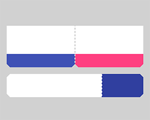

# ShapeOfView

Give a custom shape to any android view Useful for Material Design 2

[](https://www.github.com/florent37/ShapeOfView)
[](https://www.github.com/florent37/ShapeOfView)
[](https://www.github.com/florent37/ShapeOfView)

```java
//using maven central

dependencies{
        implementation'io.github.yehiareda:shapecontainer:1.0.0'
        }
```

# Sample

What you can do with Shape Of View :

[](https://www.github.com/florent37/ShapeOfView)

# Use implemented shapes

ShapeOfView **disable** the `background` property of your view, please specify a child with a
background to enable it

```xml

<io.github.yehiareda.shapecontainer.shapes.CircleView<FrameLayout android:background="@color/blue"
```

ShapeOfView came with pre-created shapes :

## Circle

[](https://www.github.com/florent37/ShapeOfView)

```xml

<io.github.yehiareda.shapecontainer.shapes.CircleView android:layout_width="150dp"
    android:layout_height="150dp"

    android:elevation="4dp" app:shape_circle_borderColor="@android:color/black"
    app:shape_circle_borderWidth="2dp">

    <!-- YOUR CONTENT -->

</io.github.yehiareda.shapecontainer.shapes.CircleView>
```

## RoundRect

[](https://www.github.com/florent37/ShapeOfView)

```xml

<io.github.yehiareda.shapecontainer.shapes.RoundRectView android:layout_width="150dp"
    android:layout_height="100dp" android:elevation="4dp"
    app:shape_roundRect_bottomLeftRadius="10dp" app:shape_roundRect_bottomRightRadius="10dp"
    app:shape_roundRect_topLeftRadius="10dp" app:shape_roundRect_topRightRadius="10dp"

    app:shape_roundRect_borderColor="@android:color/black" app:shape_roundRect_borderWidth="2dp">


    <!-- YOUR CONTENT -->

</io.github.yehiareda.shapecontainer.shapes.RoundRectView>
```

## ClipCorner

[](https://www.github.com/florent37/ShapeOfView)

```xml

<io.github.yehiareda.shapecontainer.shapes.CutCornerView android:id="@+id/clipCorner"
    android:layout_width="150dp" android:layout_height="100dp" android:elevation="4dp"
    app:shape_cutCorner_bottomRightSize="20dp">

    <!-- YOUR CONTENT -->

</io.github.yehiareda.shapecontainer.shapes.CutCornerView>
```

## Arc

[](https://www.github.com/florent37/ShapeOfView)

```xml

<io.github.yehiareda.shapecontainer.shapes.ArcView android:layout_width="150dp"
    android:layout_height="100dp" android:elevation="4dp" app:shape_arc_cropDirection="outside"
    app:shape_arc_height="20dp" app:shape_arc_position="bottom">

    <!-- YOUR CONTENT -->

</io.github.yehiareda.shapecontainer.shapes.ArcView>
```

## Diagonal

[](https://www.github.com/florent37/ShapeOfView)

```xml

<io.github.yehiareda.shapecontainer.shapes.DiagonalView android:layout_width="150dp"
    android:layout_height="100dp" android:elevation="4dp" app:shape_diagonal_angle="10"
    app:shape_diagonal_direction="right" app:shape_diagonal_position="bottom">

    <!-- YOUR CONTENT -->

</io.github.yehiareda.shapecontainer.shapes.DiagonalView>
```

## Triangle

[](https://www.github.com/florent37/ShapeOfView)

```xml

<io.github.yehiareda.shapecontainer.shapes.TriangleView android:layout_width="150dp"
    android:layout_height="150dp" android:elevation="4dp"

    app:shape_triangle_percentBottom="0.5" app:shape_triangle_percentLeft="0"
    app:shape_triangle_percentRight="0">

    <!-- YOUR CONTENT -->

</io.github.yehiareda.shapecontainer.shapes.TriangleView>
```

## Bubble

[](https://www.github.com/florent37/ShapeOfView)

```xml

<io.github.yehiareda.shapecontainer.shapes.BubbleView android:layout_width="150dp"
    android:layout_height="150dp" app:shape_bubble_arrowHeight="10dp"
    app:shape_bubble_arrowWidth="10dp" app:shape_bubble_arrowPosition="bottom"
    app:shape_bubble_borderRadius="20dp" app:arrow_posititon_percent="0.5">

    <!-- YOUR CONTENT -->

</io.github.yehiareda.shapecontainer.shapes.BubbleView>
```

## Star

[](https://www.github.com/florent37/ShapeOfView)
[](https://www.github.com/florent37/ShapeOfView)

```xml

<io.github.yehiareda.shapecontainer.shapes.StarView android:layout_width="150dp"
    android:layout_height="150dp" app:shape_star_noOfPoints="5">

    <!-- YOUR CONTENT -->

</io.github.yehiareda.shapecontainer.shapes.StarView>
```

## Polygon

[](https://www.github.com/florent37/ShapeOfView)

```xml

<io.github.yehiareda.shapecontainer.shapes.PolygonView android:layout_width="150dp"
    android:layout_height="100dp" app:shape_polygon_noOfSides="9">
    <!-- YOUR CONTENT -->

</io.github.yehiareda.shapecontainer.shapes.PolygonView>
```

## Dotted Edges with Cut Corners

[](https://www.github.com/florent37/ShapeOfView)

```xml

<io.github.yehiareda.shapecontainer.shapes.DottedEdgesCutCornerView android:layout_width="100dp"
    android:layout_height="match_parent" app:shape_dot_radius="3dp" app:shape_dot_spacing="2dp"
    app:shape_edge_position="right|left" app:shape_dottedEdgesCutCorner_bottomLeftSize="8dp"
    app:shape_dottedEdgesCutCorner_bottomRightSize="8dp">

    <!-- YOUR CONTENT -->

</io.github.yehiareda.shapecontainer.shapes.DottedEdgesCutCornerView>
```

## Animation

All shapes methods can be animated

For example, you can animate a RoundRect corner :

[](https://www.github.com/florent37/ShapeOfView)

```kotlin
ValueAnimator.ofFloat(0f, 200f, 0f).apply {
    addUpdateListener { animation ->
        roundRect.bottomLeftRadius = (animation.animatedValue as Float).toInt()
    }
    duration = 800
    repeatCount = ValueAnimator.INFINITE
    repeatMode = ValueAnimator.REVERSE
}.start()
```

# Create you own shape

You can use custom shape to cut your view

# Using Drawable (no elevation)

[](https://www.github.com/florent37/ShapeOfView)

```xml

<io.github.yehiareda.shapecontainer.ShapeOfView android:layout_width="100dp"
    android:layout_height="100dp"

    app:shape_clip_drawable="@drawable/YOUR_DRAWABLE">

    <!-- YOUR CONTENT -->

</io.github.yehiareda.shapecontainer.ShapeOfView>
```

# Using Path (with elevation)

This method generates also a **shadow path** (with Lollipop elevation API 21+)

Wrap your view with a `ShapeOfView`

```xml

<io.github.yehiareda.shapecontainer.ShapeOfView android:id="@+id/myShape"
    android:layout_width="30dp" android:layout_height="15dp" android:elevation="6dp">

    <!-- YOUR CONTENT -->

</io.github.yehiareda.shapecontainer.ShapeOfView>
```

Then generate a path in your code :

```java
ShapeContainer shapeContainer=findViewById(R.id.myShape)
        ShapeContainer.setClipPathCreator(new ClipPathManager.ClipPathCreator(){
@Override
public Path createClipPath(int width,int height){
final Path path=new Path();

        //eg: triangle
        path.moveTo(0,0);
        path.lineTo(0.5*width,height);
        path.lineTo(width,0);
        path.close();

        return path;
        }
        });
```

In some case you have to specify `requiresBitmap = true` to enable ShapeOfView to draw the shape
inside a bitmap before clipping your view. It will be less efficient but can make your custom shape
work.

